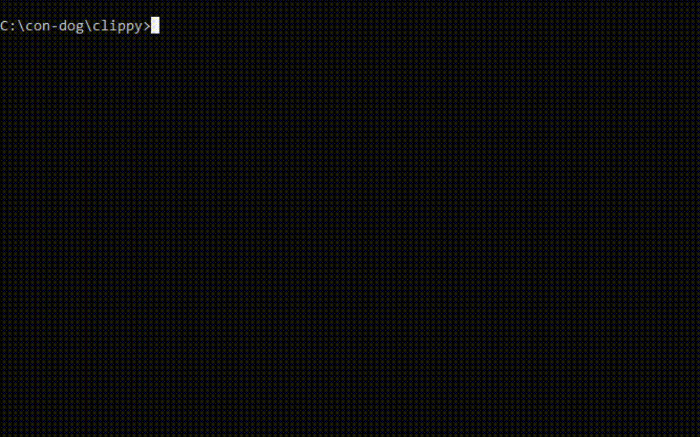

  

# clippy - 
Create *animated ASCII-art* for the command line! 

clippy stands for:
command line interface player made in python

clippy is your *friend* if you are;
- Developing a rogue-like ASCII game
- Creating a TUI
- Wanting to make ASCII-art
- Wanting to make ***animated*** ASCII art
- Wanting to explore the Python standard library

## Example Animation ##

| Get this clip | From this txt file/s! |
| -------- | ---------- |
|

|
................. ........~...v.... .........../&#124;.... .....v..../_&#124;__.. .........&#92;-----/. ~~~~~~~~~`~~~~~~'
|

## How clippy works ##
A given directory, say, art/sea contains multiple txt files of a ship at sea. clippy looks at all the txt files in the directory and sequentially prints to the console output and handles cursor movement.

Each txt file acts as a 'frame' of the clip; Minor variations between these text files creates the animation! 

## Make your own animations ##
### Steps ###
1) Create a sub-directory inside the 'art' directory. Give it a meaningful name eg: "Sailing_boat" for a sailing boat animation
2) Create a base/template txt file. Your ASCII-art template will live in here. Do it yourself or get ideas from https://www.asciiart.eu/
  Eg: your base might have some ASCII-art like this in it (or anything you want!)

................. ........~...v.... .........../&#124;.... .....v..../_&#124;__.. .........&#92;-----/. ~~~~~~~~~`~~~~~~'

3) Make multiple copies of this file and in each copy, make some minor changes, for example below I've shifted the boat left, and added a seagull: Tip: You can add as many frames and variations as you want. The more the better!

.....\,/......... ~...v............ .../&#124;............ ../_|__.......... .\-----/......... ~`~~~~~~'~~~~~~~~

4) Run clip.py and pass the relative path of the directory containing your txt files (frames), pass it the speed (1-100), and pass it the number of cycles to run (1-1000)
5) Enjoy and contribute your art here! Submit a pull request of your art to this repo!
