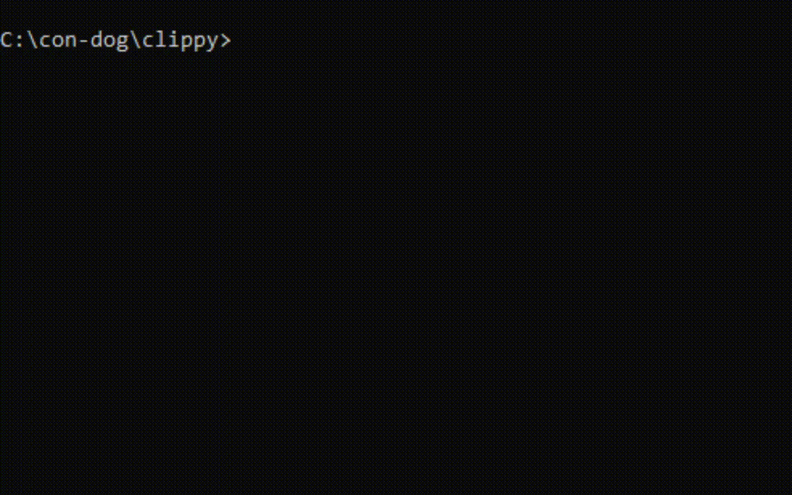

<p align="center"></p>

# clippy
Create and play colored 🟥🟩🟦 or colorless ⬛️⬜️ animated, or static, ASCII-art in the command line! 

clippy can help if you are wanting to;
- Develop a rogue-like ASCII game
- Develop word games (animate text)
- Develeop TUI's or CUI's
- Develop a Terminal screensaver
- Create animated logos for your scripts
- Make ASCII-art
- Make coloured ASCII art
- Make animated ASCII art
- Only use the Python standard library!

## Example Animation ##
| Get this clip | From this txt file/s! |
| -------- | ---------- |
|<p align="center"></p>|<p align="center">.................<br>........~...v....<br>.........../&#124;....<br>.....v..../_&#124;__..<br>.........&#92;-----/.<br>~~~~~~~~~`~~~~~~'</p>|

## How clippy works ##
clippy looks at all the txt files in a directory, and sequentially prints each file to the console in the same line/column position. If the color flaf is passed, it maps colors onto each frame.

Each txt file acts as a 'frame' of the clip; Minor variations between these text files creates the animation! 

## Make your own animations ##
### Steps ###
1) Create a sub-directory inside the 'art' directory. Eg: under sea/boats. Give it a meaningful name eg: "small_boat_1" for a sailing boat animation

 ```
 clip
    ├───art
    ├───animals
    ...
    ...
    └───sea
        └───boats
            └───small_boat_1
```

2) In this folder create 2 sub-directories: 'ascii' and 'color'
 
 ```
 clip
    ├───art
    ├───animals
    ...
    ...
    └───sea
        └───boats
            └───small_boat_1
                ├───ascii
                └───color
```

3) In the 'ascii' sub-directory create a base/template txt file. Your ASCII-art template will live in here. Do it yourself or get ideas from https://www.asciiart.eu/
  Eg: your base might have some ASCII-art like this in it (or anything you want!)
  
  ```
   clip
    ├───art
    ├───animals
    ...
    ...
    └───sea
        └───boats
            └───small_boat_1
                ├───ascii
                |       └───small_boat_1a.txt
                |       └───small_boat_1b.txt
                |       ...
                |       ...
                |       └───small_boat_1h.txt
                └───color
  ```
  
  The text file might look something like this:
  
<p align="center">.................<br>........~...v....<br>.........../&#124;....<br>.....v..../_&#124;__..<br>.........&#92;-----/.<br>~~~~~~~~~`~~~~~~'</p>

4) Make copies of this file, and in each copy, make some minor changes!

For the example below I've shifted the boat left, and added a seagull:

<p align="center">.....\,/.........<br>~...v............<br>.../&#124;............<br>../_|__..........<br>.\-----/.........<br>~`~~~~~~'~~~~~~~~</p>

5) Run clip.py and pass the relative path of the directory containing your txt files (frames), pass it the speed (1-100), and pass it the number of cycles to run (1-1000)
 
6) Enjoy and contribute your art here! Submit a pull request of your art to this repo!

## ROADMAP ##
1) Update steps and add steps to do color
2) Build library of ASCII-art and animated ASCII-art
3) Auto-colour terminal art 
4) Generative ASCII-art
